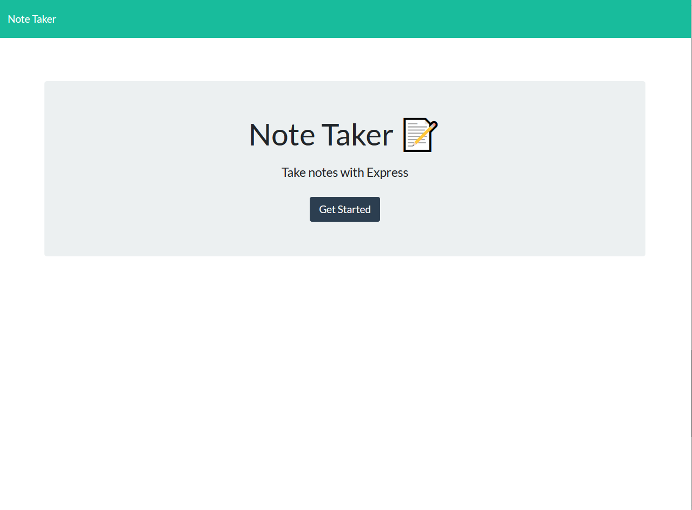
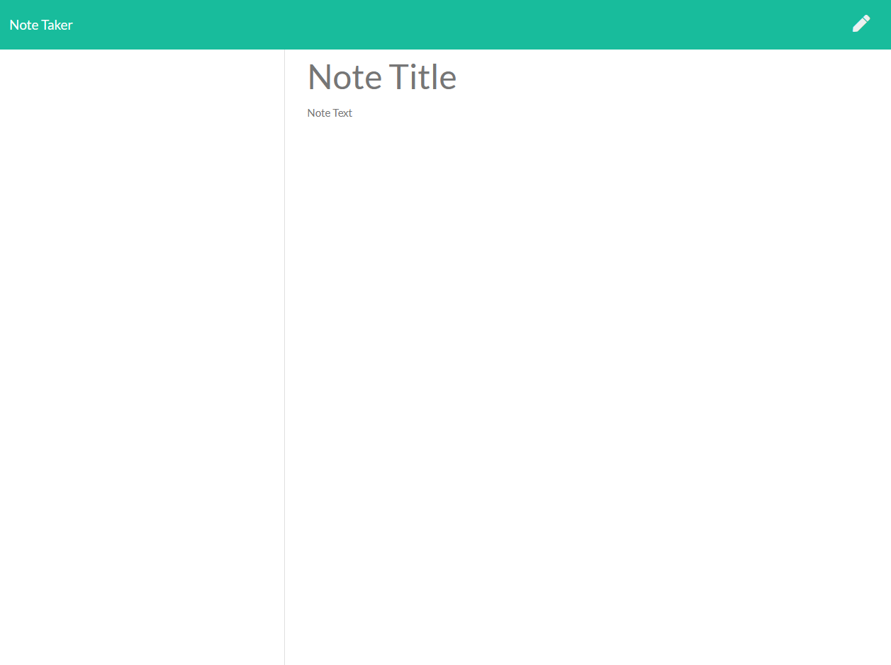
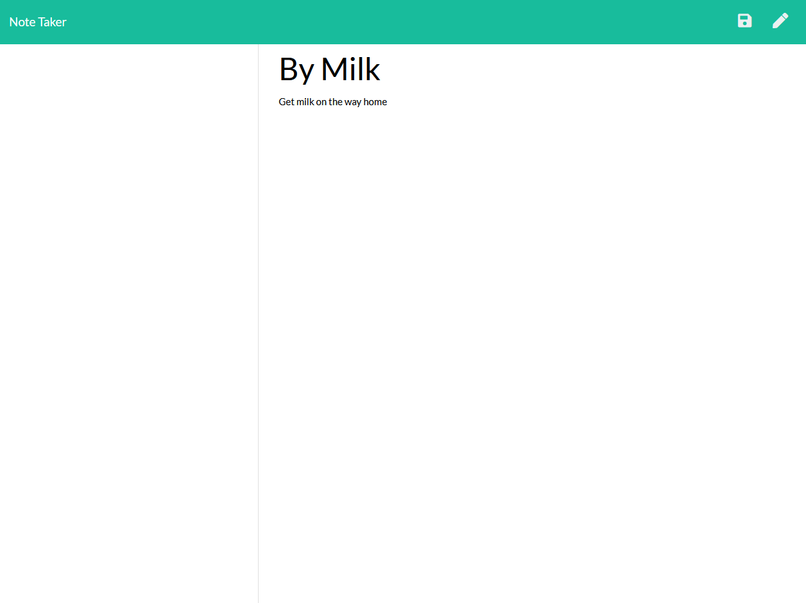
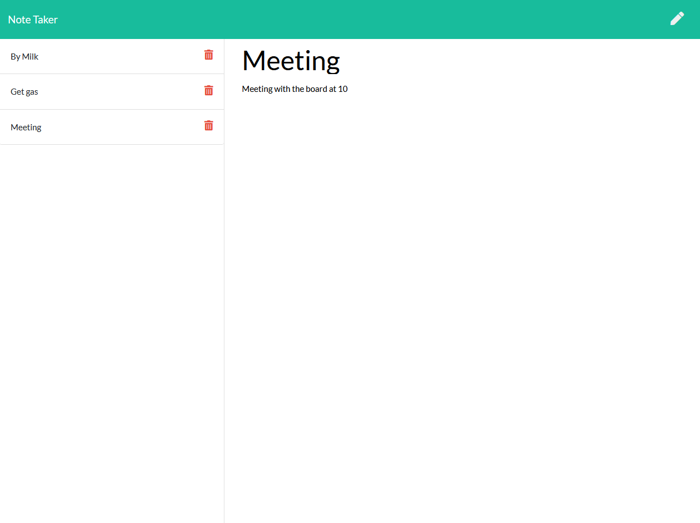

# Note Taker

## Links

https://github.com/ZFarnworth/noteTaker
https://notetakerzfarny.herokuapp.com/

## Table of Contents

- [Usage](#usage)
- [Description](#Description)
- [Installation:](#Installation:)

## Description

Note taking app that allows you to put a title and description of a task.

## Installation

Download or Clone the github repo and install dependencies such as Node.js, inquirer and Jest.
https://nodejs.org/en/download/
https://www.npmjs.com/package/express

## License Details:

No License

## List of Contributors:

Zac Farnworth

## Usage

1. User is greeted with a simple home page that has a button saying "Get Started". Once the button is selected they are redirected.

 2) Once the "Get Started" button is selected they are taken to the "notes" home page. The user can type in a "Note Title" as well as "Note Text" below that. There is also a button in the corner that allows the user to restart their note if there is a mistake or they change their mind.

 3) Once the user starts to enter information a "save" button will not appear until the user has put in both the "Note Title" as well as the "Note Text"

 4) Once the note is saved it will be conveniently saved to the column on the left side, the user will have 2 options.
